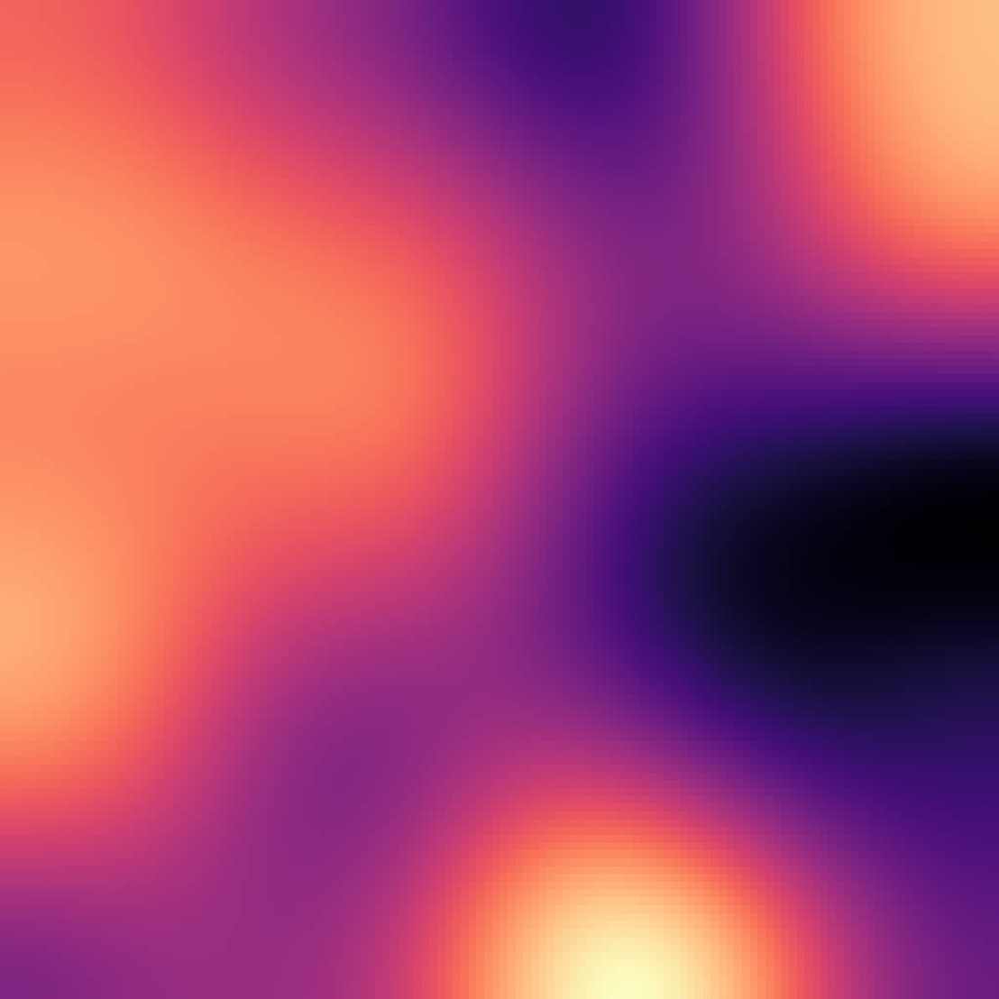
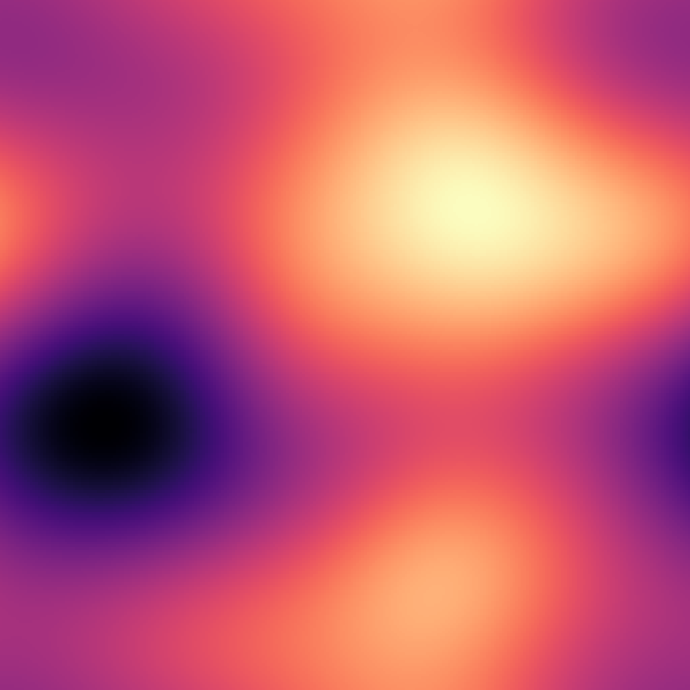
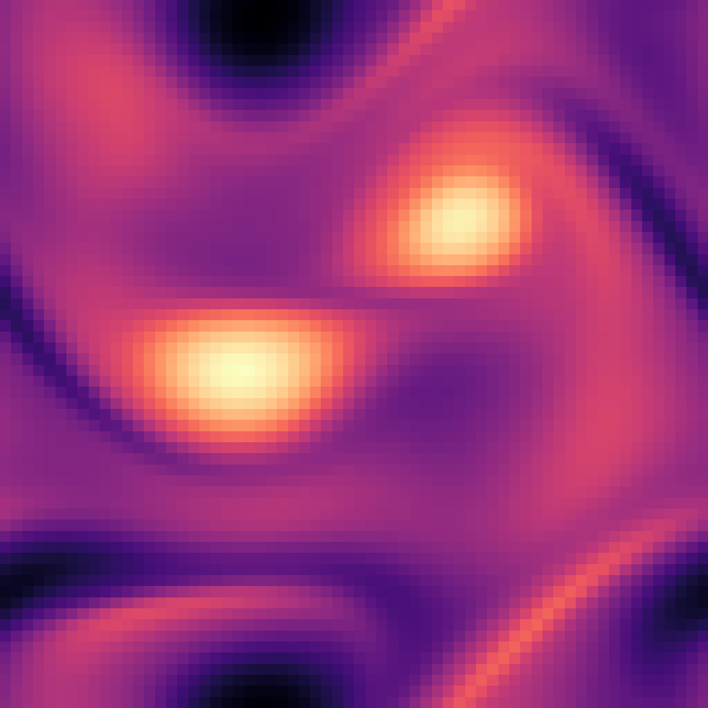
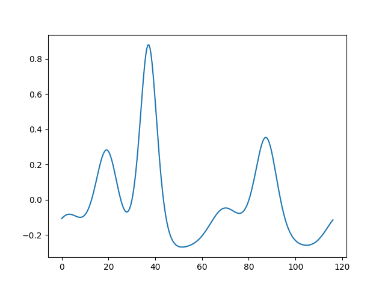
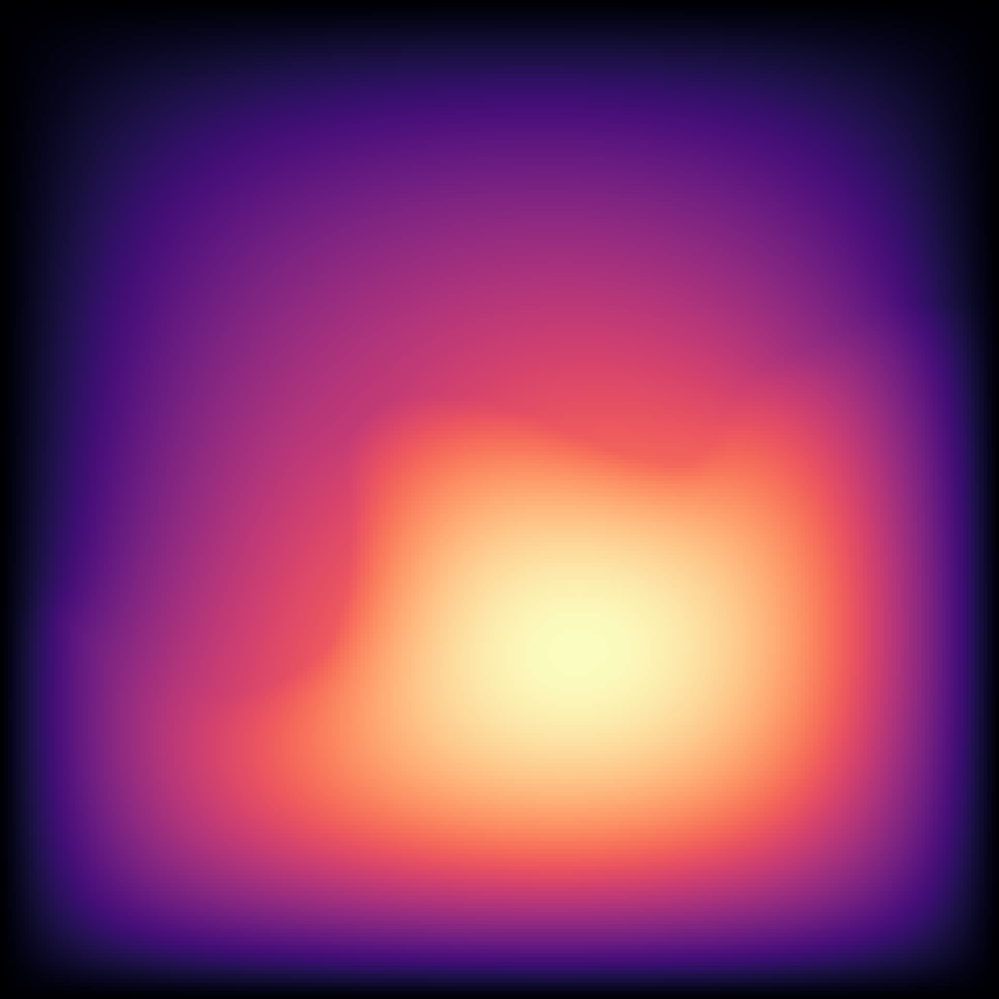

# PDEInvBench Data Guide

## Table of Contents

1. [Dataset Link](#1-dataset-link)
2. [Downloading Data](#2-downloading-data)
3. [Overview](#3-overview)
   - [3.1 Data Format](#31-data-format)
   - [3.2 Parameter Extraction from Filenames](#32-parameter-extraction-from-filenames)
   - [3.3 Working with High-Resolution Data](#33-working-with-high-resolution-data)
   - [3.4 Data Loading Parameters](#34-data-loading-parameters)
   - [3.5 Parameter Normalization](#35-parameter-normalization)
4. [Datasets](#4-datasets)
   - [4a. 2D Reaction Diffusion](#4a-2d-reaction-diffusion)
   - [4b. 2D Navier Stokes (Unforced)](#4b-2d-navier-stokes-unforced)
   - [4c. 2D Turbulent Flow (Forced Navier Stokes)](#4c-2d-turbulent-flow-forced-navier-stokes)
   - [4d. 1D Korteweg-De Vries](#4d-1d-korteweg-de-vries)
   - [4e. 2D Darcy Flow](#4e-2d-darcy-flow)
5. [Adding a New Dataset](#5-adding-a-new-dataset)


## 1. Dataset Link

The dataset used in this project can be found here:
https://huggingface.co/datasets/DabbyOWL/PDE_Inverse_Problem_Benchmarking/tree/main

## 2. Downloading Data

We provide a python script: [`huggingface_pdeinv_download.py`](huggingface_pdeinv_download.py) to batch download our hugging-face data. We will update the readme of our hugging-face dataset and our github repo to reflect this addition. To run this:

```bash
pip install huggingface_hub
python3 huggingface_pdeinv_download.py [--dataset DATASET_NAME] [--split SPLIT] [--local-dir PATH]
```

**Available datasets:** `darcy-flow-241`, `darcy-flow-421`, `korteweg-de-vries-1d`, `navier-stokes-forced-2d-2048`, `navier-stokes-forced-2d`, `navier-stokes-unforced-2d`, `reaction-diffusion-2d-du-512`, `reaction-diffusion-2d-du`, `reaction-diffusion-2d-k-512`, `reaction-diffusion-2d-k`

**Available splits:** `*` (all), `train`, `validation`, `test`, `out_of_distribution`, `out_of_distribution_extreme`

We also provide a data inspection guide [`data_inspection_guide.ipynb`](data_inspection_guide.ipynb), which demonstrates how to download files and explores their internal structure.

## 3. Overview

The PDEInvBench dataset contains five PDE systems spanning parabolic, hyperbolic, and elliptic classifications, designed for benchmarking inverse parameter estimation.

### Dataset Scale and Scope

The dataset encompasses **over 1.2 million individual simulations** across five PDE systems, with varying spatial and temporal resolutions:

- **2D Reaction Diffusion**: 28×28×27 = 21,168 parameter combinations × 5 trajectories = 105,840 simulations
- **2D Navier Stokes**: 101 parameter values × 192 trajectories = 19,392 simulations  
- **2D Turbulent Flow**: 120 parameter values × 108 trajectories = 12,960 simulations
- **1D Korteweg-De Vries**: 100 parameter values × 100 trajectories = 10,000 simulations
- **2D Darcy Flow**: 2,048 unique coefficient fields

### Multi-Resolution Architecture

The dataset provides multiple spatial resolutions for each system, enabling studies on resolution-dependent generalization:

- **Low Resolution**: 64×64 (2D systems), 256 (1D KdV), 241×241 (Darcy Flow)
- **Medium Resolution**: 128×128 (2D systems), 256×256 (Turbulent Flow)
- **High Resolution**: 256×256, 512×512, 1024×1024 (2D systems), 421×421 (Darcy Flow)

### Physical and Mathematical Diversity

**Parabolic Systems** (Time-dependent, diffusive):
- **2D Reaction Diffusion**: Chemical pattern formation with Fitzhugh-Nagumo dynamics
- **2D Navier Stokes**: Fluid flow without external forcing
- **2D Turbulent Flow**: Forced fluid dynamics with Kolmogorov forcing

**Hyperbolic Systems** (Wave propagation):
- **1D Korteweg-De Vries**: Soliton dynamics in shallow water waves

**Elliptic Systems** (Steady-state):
- **2D Darcy Flow**: Groundwater flow through porous media

### Parameter Space Coverage

The dataset systematically explores parameter spaces across different physical regimes:

- **Reaction Diffusion**: k ∈ [0.005,0.1], Du ∈ [0.01,0.5], Dv ∈ [0.01,0.5] (Turing bifurcations)
- **Navier Stokes**: ν ∈ [10⁻⁴,10⁻²] (Reynolds: 80-8000, laminar to transitional)
- **Turbulent Flow**: ν ∈ [10⁻⁵,10⁻²] (fully developed turbulence)
- **Korteweg-De Vries**: δ ∈ [0.8,5] (dispersion strength in shallow water)
- **Darcy Flow**: Piecewise constant diffusion coefficients (porous media heterogeneity)

### Evaluation Framework

The dataset implements a sophisticated three-tier evaluation system for comprehensive generalization testing:

1. **In-Distribution (ID)**: Parameters within training ranges for baseline performance
2. **Out-of-Distribution (Non-Extreme)**: Middle-range parameters excluded from training
3. **Out-of-Distribution (Extreme)**: Extremal parameter values for stress testing

This framework enables systematic evaluation of model robustness across parameter space, critical for real-world deployment where models must generalize beyond training distributions.


### Data Organization and Accessibility

The dataset is organized in a standardized HDF5 format with:

- **Hierarchical Structure**: Train/validation/test splits with consistent naming conventions
- **Parameter Encoding**: Filenames encode parameter values for easy parsing
- **Multi-Channel Support**: 2D systems support multiple solution channels (velocity components, chemical species)
- **Grid Information**: Complete spatial and temporal coordinate information
- **Normalization Statistics**: Pre-computed parameter normalization for consistent preprocessing

### Key Features for Inverse Problem Benchmarking

1. **Multi-Physics Coverage**: Spans chemical, fluid, wave, and porous media physics
2. **Resolution Scalability**: Enables studies on resolution-dependent model behavior
3. **Parameter Diversity**: Systematic exploration of parameter spaces across physical regimes
4. **Generalization Testing**: Built-in evaluation framework for out-of-distribution performance
5. **Computational Efficiency**: Optimized data loading and preprocessing pipelines
6. **Reproducibility**: Complete documentation of generation parameters and solver configurations

This comprehensive dataset provides researchers with a unified platform for developing and evaluating inverse problem solving methods across diverse scientific domains, enabling systematic comparison of approaches and identification of fundamental limitations in current methodologies.

### 3.1 Data Format

All datasets are stored in HDF5 format with specific structure depending on the PDE system.

#### Directory Structure

Datasets should be organized in the following directory structure:

```
/path/to/data/
├── train/
│   ├── param_file_1.h5
│   ├── param_file_2.h5
│   └── ...
├── validation/
│   ├── param_file_3.h5
│   └── ...
└── test/
    ├── param_file_4.h5
    └── ...
```

### 3.2 Parameter Extraction from Filenames

Parameters are extracted from filenames using pattern matching. For example:

- **2D Reaction Diffusion**: `Du=0.1_Dv=0.2_k=0.05.h5`
  - Du = 0.1, Dv = 0.2, k = 0.05
  
- **2D Navier Stokes**: `83.0.h5` 
  - Reynolds number = 83.0
  
- **1D KdV**: `delta=3.5_ic=42.h5`
  - δ = 3.5

### 3.3 Working with High-Resolution Data

For high-resolution datasets, we provide configurations for downsampling:

| PDE System | Original Resolution | High-Resolution |
|------------|:-------------------:|:---------------:|
| 2D Reaction Diffusion | 128×128 | 256×256, 512×512 |
| 2D Navier Stokes | 64×64 | 128×128, 256×256 |
| 2D Turbulent Flow | 256×256 | 512×512, 1024×1024 |
| Darcy Flow | 241×241 | 421×421 |

When working with high-resolution data, set the following parameters:

```bash
high_resolution=True
data.downsample_factor=4  # e.g., for 512×512 → 128×128
data.batch_size=2         # Reduce batch size for GPU memory
```

### 3.4 Data Loading Parameters

Key parameters for loading data:

- `data.every_nth_window`: Controls sampling frequency of time windows
- `data.frac_ics_per_param`: Fraction of initial conditions per parameter to use
- `data.frac_param_combinations`: Fraction of parameter combinations to use
- `data.train_window_end_percent`: Percentage of trajectory used for training
- `data.test_window_start_percent`: Percentage where test window starts

### 3.5 Parameter Normalization

Parameters are normalized using the following statistics, where the mean and standard deviation are computed using the span of the parameters in the dataset:

```python
PARAM_NORMALIZATION_STATS = {
    PDE.ReactionDiffusion2D: {
        "k": (0.06391126306498819, 0.029533048151465856),    # (mean, std)
        "Du": (0.3094992685910578, 0.13865605073673604),     # (mean, std)
        "Dv": (0.259514500345804, 0.11541850276902947),      # (mean, std)
    },
    PDE.NavierStokes2D: {"re": (1723.425, 1723.425)},        # (mean, std)
    PDE.TurbulentFlow2D: {"nu": (0.001372469573118451, 0.002146258280849241)},
    PDE.KortewegDeVries1D: {"delta": (2.899999997019768, 1.2246211546444339)},
    # Add more as needed
}
```

## 4. Datasets

This section provides detailed information about each PDE system in the dataset. Each subsection includes visualizations, descriptions, and technical specifications.

### 4a. 2D Reaction Diffusion




**Description:** The 2D Reaction-Diffusion system models chemical reactions with spatial diffusion using the Fitzhugh-Nagumo equations. This dataset contains two-channel solutions (activator u and inhibitor v) with parameters k (threshold for excitement), Du (activator diffusivity), and Dv (inhibitor diffusivity). The system exhibits complex pattern formation including spots, stripes, and labyrinthine structures, spanning from dissipative to Turing bifurcations.

**Mathematical Formulation:**
The activator u and inhibitor v coupled system follows:

```
∂tu = Du∂xxu + Du∂yyu + Ru
∂tv = Dv∂xxv + Dv∂yyv + Rv
```

where Ru and Rv are defined by the Fitzhugh-Nagumo equations:

```
Ru(u,v) = u - u³ - k - v
Rv(u,v) = u - v
```

**Parameters of Interest:**
- **Du**: Activator diffusion coefficient
- **Dv**: Inhibitor diffusion coefficient  
- **k**: Threshold for excitement

**Data Characteristics:**
- Partial Derivatives: 5
- Time-dependent: Yes (parabolic)
- Spatial Resolutions: 128×128, 512x512
- Parameters: k ∈ [0.005,0.1], Du ∈ [0.01,0.5], Dv ∈ [0.01,0.5]
- Temporal Resolution: 0.049/5 seconds
- Parameter Values: k - 28, Du - 28, Dv - 27
- Initial Conditions/Trajectories: 5

**Evaluation Splits:**
- **Test (ID)**: k ∈ [0.01,0.04] ∪ [0.08,0.09], Du ∈ [0.08,0.2] ∪ [0.4,0.49], Dv ∈ [0.08,0.2] ∪ [0.4,0.49]
- **OOD (Non-Extreme)**: k ∈ [0.04,0.08], Du ∈ [0.2,0.4], Dv ∈ [0.2,0.4]
- **OOD (Extreme)**: k ∈ [0.001,0.01] ∪ [0.09,0.1], Du ∈ [0.02,0.08] ∪ [0.49,0.5], Dv ∈ [0.02,0.08] ∪ [0.49,0.5]

**Generation Parameters:**
- **Solver**: Explicit Runge-Kutta method of order 5(4) (RK45)
- **Error Tolerance**: Relative error tolerance of 10⁻⁶
- **Spatial Discretization**: Finite Volume Method (FVM) with uniform 128×128 grid
- **Domain**: [-1,1] × [-1,1] with cell size Δx = Δy = 0.015625
- **Burn-in Period**: 1 simulation second
- **Dataset Simulation Time**: [0,5] seconds, 101 time steps
- **Nominal Time Step**: Δt ≈ 0.05 seconds (adaptive)
- **Generation Time**: ≈ 1 week on CPU

**Folder Descriptions**
- `reaction-diffusion-2d-k`: 2D Reaction Diffusion splits for 128x128 resolution spatial fields for parameter k
- `reaction-diffusion-2d-k-512`: 2D Reaction Diffusion splits for 512x512 resolution spatial fields for parameter k
- `reaction-diffusion-2d-Du`: 2D Reaction Diffusion splits for 128x128 resolution spatial fields for parameter Du
- `reaction-diffusion-2d-Du-512`: 2D Reaction Diffusion splits for 512x512 resolution spatial fields for parameter Du

**File Structure:**
```
filename: Du=0.1_Dv=0.2_k=0.05.h5
```
Contents:
- `0001/data`: Solution field [time, spatial_dim_1, spatial_dim_2, channels]
- `0001/grid/x`: x-coordinate grid points
- `0001/grid/y`: y-coordinate grid points
- `0001/grid/t`: Time points

### 4b. 2D Navier Stokes (Unforced)



**Description:** The 2D Navier-Stokes equations describe incompressible fluid flow without external forcing. This dataset contains velocity field solutions with varying Reynolds numbers, showcasing different flow regimes from laminar to transitional flows.

**Mathematical Formulation:**
We consider the vorticity form of the unforced Navier-Stokes equations:

```
∂w(t,x,y)/∂t + u(t,x,y)·∇w(t,x,y) = νΔw(t,x,y)
```

for t ∈ [0,T] and (x,y) ∈ (0,1)², with auxiliary conditions:
- w = ∇ × u
- ∇ · u = 0
- w(0,x,y) = w₀(x,y) (Boundary Conditions)

**Parameters of Interest:**
- **ν**: The physical parameter of interest, representing viscosity

**Data Characteristics:**
- Partial Derivatives: 3
- Time-dependent: Yes (parabolic)
- Spatial Resolutions: 64×64
- Parameters: ν ∈ [10⁻⁴,10⁻²] (Reynolds: 80-8000)
- Temporal Resolution: 0.0468/3 seconds
- Parameter Values: 101
- Initial Conditions/Trajectories: 192

**Evaluation Splits:**
- **Test (ID)**: ν ∈ [10⁻³·⁸, 10⁻³·²] ∪ [10⁻²·⁸, 10⁻²·²]
- **OOD (Non-Extreme)**: ν ∈ [10⁻³·², 10⁻²·⁸]
- **OOD (Extreme)**: ν ∈ [10⁻⁴, 10⁻³·⁸] ∪ [10⁻²·², 10⁻²]

**Generation Parameters:**
- **Solver**: Pseudo-spectral solver with Crank-Nicolson time-stepping
- **Implementation**: Written in Jax and GPU-accelerated
- **Generation Time**: ≈ 3.5 GPU days (batch size=32)
- **Burn-in Period**: 15 simulation seconds
- **Saved Data**: Next 3 simulation seconds saved as dataset
- **Initial Conditions**: Sampled according to Gaussian random field (length scale=0.8)
- **Recording**: Solution recorded every 1 simulation second
- **Simulation dt**: 1e-4
- **Resolution**: 256×256


**Folder Descriptions**
- `navier-stokes-unforced-2d-64`:  2D Navier Stokes (Unforced) splits for 64x64 resolution spatial fields
- `navier-stokes-unforced-2d-256`: 2D Navier Stokes (Unforced) splits for 256x256 resolution spatial fields

**File Structure:**
```
filename: 83.0.h5
```
Contents:
- `0001/data`: Solution field [time, spatial_dim_1, spatial_dim_2, channels]
- `0001/grid/x`: x-coordinate grid points
- `0001/grid/y`: y-coordinate grid points
- `0001/grid/t`: Time points

### 4c. 2D Turbulent Flow (Forced Navier Stokes)



**Description:** The 2D Turbulent Flow dataset represents forced Navier-Stokes equations that generate fully developed turbulent flows. This dataset is particularly valuable for studying complex, multi-scale fluid dynamics and turbulent phenomena. All solutions exhibit turbulence across various Reynolds numbers.

**Mathematical Formulation:**
The forced Navier-Stokes equations with the Kolmogorov forcing function are similar to the unforced case with an additional forcing term:

```
∂ₜw + u·∇w = νΔw + f(k,y) - αw
```

where the forcing function f(k,y) is defined as:
```
f(k,y) = -kcos(ky)
```

**Parameters of Interest:**
- **ν**: Kinematic viscosity (similar to unforced NS)
- **α**: Drag coefficient (fixed at α = 0.1)
- **k**: Forced wavenumber (fixed at k = 2)

The drag coefficient α primarily serves to keep the total energy of the system constant, acting as drag. The task is to predict ν.

**Numerical Convergence**
We examine convergence across all solutions we generated. However, at the spatial and temporal resolution used to produce this dataset, simulations with kinematic viscosity ν < 5e-4 may not be fully converged due to the fine scale turbulence dynamics. We include all generated trajectories in the training set to maximize coverage of the parameter space and to expose models to a broader range of flow regimes. Nevertheless, we recommend restricting quantitative evaluation and model selection to runs with ν >= 5e-4. For more details, please see our paper.

**Data Characteristics:**
- Partial Derivatives: 3
- Time-dependent: Yes (parabolic)
- Spatial Resolutions: 64x64, 2048x2048
- Parameters: ν ∈ [10⁻⁵,10⁻²]
- Temporal Resolution: 0.23/14.75 seconds
- Parameter Values: 120
- Initial Conditions/Trajectories: 108

**Evaluation Splits:**
- **Test (ID)**: ν ∈ [10⁻⁴·⁷, 10⁻³·⁸] ∪ [10⁻³·², 10⁻²·³]
- **OOD (Non-Extreme)**: ν ∈ [10⁻³·⁸, 10⁻³·²]
- **OOD (Extreme)**: ν ∈ [10⁻⁵, 10⁻⁴·⁷] ∪ [10⁻²·³, 10⁻²]

**Generation Parameters:**
- **Solver**: Pseudo-spectral solver with Crank-Nicolson time-stepping
- **Implementation**: Written in Jax (leveraging Jax-CFD), similar to 2D NS
- **Generation Time**: ≈ 4 GPU days (A100)
- **Burn-in Period**: 40 simulation seconds
- **Saved Data**: Next 15 simulation seconds saved as dataset
- **Simulator Resolution**: 256×256
- **Downsampling**: Downsamples to 64×64 before saving
- **Temporal Resolution (Saved)**: ∂t = 0.25 simulation seconds


**Folder Descriptions**
- `navier-stokes-forced-2d`:  2D Navier Stokes (Forced) splits for 64x64 resolution spatial fields
- `navier-stokes-forced-2d-2048`: 2D Navier Stokes (Forced) splits for 2048x2048 resolution spatial fields


**File Structure:**
```
filename: nu=0.001.h5
```
Contents:
- `0001/data`: Solution field [time, spatial_dim_1, spatial_dim_2, channels]
- `0001/grid/x`: x-coordinate grid points
- `0001/grid/y`: y-coordinate grid points
- `0001/grid/t`: Time points

### 4d. 1D Korteweg-De Vries



**Description:** The Korteweg-De Vries (KdV) equation is a nonlinear partial differential equation that describes shallow water waves and solitons. This 1D dataset contains soliton solutions with varying dispersion parameters, demonstrating wave propagation and interaction phenomena.

**Mathematical Formulation:**
KdV is a 1D PDE representing waves on a shallow-water surface. The governing equation follows the form:

```
0 = ∂ₜu + u·∂ₓu + δ²∂ₓₓₓu
```

**Parameters of Interest:**
- **δ**: The physical parameter representing the strength of the dispersive effect on the system
- In shallow water wave theory, δ is a unit-less quantity roughly indicating the relative depth of the water

**Data Characteristics:**
- Partial Derivatives: 3
- Time-dependent: Yes (hyperbolic)
- Spatial Resolution: 256
- Parameters: δ ∈ [0.8,5]
- Temporal Resolution: 0.73/102 seconds
- Parameter Values: 100
- Initial Conditions/Trajectories: 100

**Evaluation Splits:**
- **Test (ID)**: δ ∈ [1.22, 2.48] ∪ [3.32, 4.58]
- **OOD (Non-Extreme)**: δ ∈ [2.48, 3.32]
- **OOD (Extreme)**: δ ∈ [0.8, 1.22] ∪ [4.58, 5]

**Generation Parameters:**
- **Domain**: Periodic domain [0,L]
- **Spatial Discretization**: Pseudospectral method with Fourier basis (Nₓ = 256 grid points)
- **Time Integration**: Implicit Runge-Kutta method (Radau IIA, order 5)
- **Implementation**: SciPy's `solve_ivp` on CPU
- **Generation Time**: ≈ 12 hours
- **Burn-in Period**: 40 simulation seconds

**Initial Conditions:**
Initial conditions are sampled from a distribution over a truncated Fourier Series:

```
u₀(x) = Σ_{k=1}^K A_k sin(2πl_k x/L + φ_k)
```

where:
- A_k, φ_k ~ U(0,1)
- l_k ~ U(1,3)

**Folder Descriptions**
- `korteweg-de-vries-1d`:  1D Korteweg-De Vries splits for 256 resolution fields

**File Structure:**
```
filename: delta=3.5_ic=42.h5
```
Contents:
- `tensor`: Solution field with shape [time, spatial_dim]
- `x-coordinate`: Spatial grid points
- `t-coordinate`: Time points

### 4e. 2D Darcy Flow



**Description:** The 2D Darcy Flow dataset represents steady-state flow through porous media with piecewise constant diffusion coefficients. This time-independent system is commonly used in groundwater flow modeling and subsurface transport problems. All solutions converge to a non-trivial steady-state solution based on the diffusion coefficient field.

**Mathematical Formulation:**
The 2D steady-state Darcy flow equation on a unit box Ω = (0,1)² is a second-order linear elliptic PDE with Dirichlet boundary conditions:

```
-∇·(a(x)∇u(x)) = f(x), for x ∈ Ω
u(x) = 0, for x ∈ ∂Ω
```

where:
- a ∈ L∞((0,1)²;R⁺) is a piecewise constant diffusion coefficient
- u(x) is the pressure field
- f(x) = 1 is a fixed forcing function

**Parameters of Interest:**
- **a(x)**: Piecewise constant diffusion coefficient field (spatially varying parameter)

**Data Characteristics:**
- Partial Derivatives: 2
- Time-dependent: No (elliptic)
- Spatial Resolutions: 241×241, 421×421
- Parameters: Piecewise constant diffusion coefficient a ∈ L∞((0,1)²;R⁺)
- Temporal Resolution: N/A (steady-state)
- Parameter Values: 2048
- Initial Conditions/Trajectories: N/A

**Evaluation Splits:**

Unlike time-dependent systems with scalar parameters, Darcy Flow does not admit parameter splits based on numeric ranges.  Instead, splits are defined using a derived statistic of the coefficient field.

Let \( r(a) \) denote the fraction of grid points in the coefficient field \( a(x) \) that take the maximum value (12).  
This statistic is approximately normally distributed across coefficient fields.

Splits are defined as:

- **Test (ID):** Coefficient fields whose \( r(a) \) lies within the central mass of the distribution  
- **OOD (Non-Extreme):** Not applicable  
- **OOD (Extreme):** Coefficient fields whose \( r(a) \) lies in the tails beyond \( \pm 1.5\sigma \)


**Generation Parameters:**
- **Solver**: Second-order finite difference method
- **Implementation**: Originally written in Matlab, runs on CPU
- **Resolution**: 421×421 (original), with lower resolution dataset generated by downsampling
- **Coefficient Field Sampling**: a(x) is sampled from μ = Γ(N(0, -Δ + 9I)⁻²)
- **Gamma Mapping**: Element-wise map where a_i ~ N(0, -Δ + 9I)⁻² → {3,12}
  - a_i → 12 when a_i ≥ 0
  - a_i → 3 when a_i < 0
- **Boundary Conditions**: Zero Neumann boundary conditions on the Laplacian over the coefficient field


**Folder Descriptions**
- `darcy-flow-241`:  2D Darcy Flow splits for 241x241 resolution spatial fields
- `darcy-flow-421`:  2D Darcy Flow splits for 421x421 resolution spatial fields

**File Structure:**
```
filename: sample_1024.h5
```
Contents:
- `coeff`: Piecewise constant coefficient field
- `sol`: Solution field


## 5. Adding a New Dataset

The PDEInvBench framework is designed to be modular, allowing you to add new PDE systems. This section describes how to add a new dataset to the repository. For information about data format requirements, see [Section 4.1](#41-data-format).

### Table of Contents
  - [Step 1: Add PDE Type to Utils](#step-1-add-pde-type-to-utils)
  - [Step 2: Add PDE Attributes](#step-2-add-pde-attributes)
  - [Step 3: Add Parameter Normalization Stats](#step-3-add-parameter-normalization-stats)
  - [Step 4: Add Parameter Extraction Logic](#step-4-add-parameter-extraction-logic)
  - [Step 5: Create a Dataset Handler](#step-5-create-a-dataset-handler-if-needed)
  - [Step 6: Create a Data Configuration](#step-6-create-a-data-configuration)
  - [Step 7: Add Residual Functions](#step-7-add-residual-functions)
  - [Step 8: Create a Combined Configuration](#step-8-create-a-combined-configuration)
  - [Step 9: Generate and Prepare Data](#step-9-generate-and-prepare-data)
  - [Step 10: Run Experiments](#step-10-run-experiments)
  - [Data Format Requirements](#data-format-requirements)

### Step 1: Add PDE Type to Utils

First, add your new PDE system to `pdeinvbench/utils/types.py`:

```python
class PDE(enum.Enum):
    """
    Describes which PDE system currently being used.
    """
    # Existing PDEs...
    ReactionDiffusion1D = "Reaction Diffusion 1D"
    ReactionDiffusion2D = "Reaction Diffusion 2D"
    NavierStokes2D = "Navier Stokes 2D"
    # Add your new PDE
    YourNewPDE = "Your New PDE Description"
```

### Step 2: Add PDE Attributes

Update the attribute dictionaries in `pdeinvbench/utils/types.py` with information about your new PDE:

```python
# Number of partial derivatives
PDE_PARTIALS = {
    # Existing PDEs...
    PDE.YourNewPDE: 3,  # Number of partial derivatives needed
}

# Number of spatial dimensions
PDE_NUM_SPATIAL = {
    # Existing PDEs...
    PDE.YourNewPDE: 2,  # 1 for 1D PDEs, 2 for 2D PDEs
}

# Spatial size of the grid
PDE_SPATIAL_SIZE = {
    # Existing PDEs...
    PDE.YourNewPDE: [128, 128],  # Spatial dimensions of your dataset
}

# High-resolution spatial size (if applicable)
HIGH_RESOLUTION_PDE_SPATIAL_SIZE = {
    # Existing PDEs...
    PDE.YourNewPDE: [512, 512],  # High-res dimensions
}

# Number of parameters
PDE_NUM_PARAMETERS = {
    # Existing PDEs...
    PDE.YourNewPDE: 2,  # Number of parameters in your PDE
}

# Parameter values
PDE_PARAM_VALUES = {
    # Existing PDEs...
    PDE.YourNewPDE: {
        "param1": [0.1, 0.2, 0.3],  # List of possible values for param1
        "param2": [1.0, 2.0, 3.0],  # List of possible values for param2
    },
}

# Number of data channels
PDE_NUM_CHANNELS = {
    # Existing PDEs...
    PDE.YourNewPDE: 2,  # Number of channels in your solution field
}

# Number of timesteps in the trajectory
PDE_TRAJ_LEN = {
    # Existing PDEs...
    PDE.YourNewPDE: 100,  # Number of timesteps in your trajectories
}
```

### Step 3: Add Parameter Normalization Stats

Update `pdeinvbench/data/utils.py` with normalization statistics for your PDE parameters:

```python
PARAM_NORMALIZATION_STATS = {
    # Existing PDEs...
    PDE.YourNewPDE: {
        "param1": (0.2, 0.05),  # (mean, std) for param1
        "param2": (2.0, 0.5),   # (mean, std) for param2
    },
}
```

### Step 4: Add Parameter Extraction Logic

Add logic to extract parameters from your dataset files in `extract_params_from_path` function inside the dataset class:

```python
def extract_params_from_path(path: str, pde: PDE) -> dict:
    # Existing code...
    elif pde == PDE.YourNewPDE:
        # Parse the filename to extract parameters
        name = os.path.basename(path)
        # Example: extract parameters from filename format "param1=X_param2=Y.h5"
        param1 = torch.Tensor([float(name.split("param1=")[1].split("_")[0])])
        param2 = torch.Tensor([float(name.split("param2=")[1].split(".")[0])])
        param_dict = {"param1": param1, "param2": param2}
    # Existing code...
    return param_dict
```

### Step 5: Create a Dataset Handler (if needed)

If your PDE requires special handling beyond what `PDE_MultiParam` provides, create a new dataset class in `pdeinvbench/data/`:

```python
# Example: pdeinvbench/data/your_new_pde_dataset.py
import torch
from torch.utils.data import Dataset

class YourNewPDEDataset(Dataset):
    """
    Custom dataset class for your new PDE system.
    """
    def __init__(
        self,
        data_root: str,
        pde: PDE,
        n_past: int,
        n_future: int,
        mode: str,
        train: bool,
        # Other parameters...
    ):
        # Initialization code...
        pass
        
    def __len__(self):
        # Implementation...
        pass
        
    def __getitem__(self, index: int):
        # Implementation...
        pass
```

Add your new dataset to `pdeinvbench/data/__init__.py`:

```python
from .pde_multiparam import PDE_MultiParam
from .your_new_pde_dataset import YourNewPDEDataset

__all__ = ["PDE_MultiParam", "YourNewPDEDataset"]
```

```markdown
### Step 6: Create System Configuration

Create `configs/system_params/your_new_pde.yaml`:

```yaml
# configs/system_params/your_new_pde.yaml
defaults:
  - base

# ============ Data Parameters ============
name: "your_new_pde_inverse"
data_root: "/path/to/your/data"
pde_name: "Your New PDE Description"  # Must match PDE enum value
num_channels: 2  # Number of solution channels (e.g., u and v)
cutoff_first_n_frames: 0  # How many initial frames to skip

# ============ Model Parameters ============
downsampler_input_dim: 2  # 1 for 1D systems, 2 for 2D systems
params_to_predict: ["param1", "param2"]  # What parameters to predict
normalize: True  # Whether to normalize predicted parameters
```

Then create the top-level config `configs/your_new_pde.yaml`:

```yaml
# configs/your_new_pde.yaml
name: your_new_pde
defaults:
  - _self_
  - base
  - override system_params: your_new_pde
```

The existing configs/data/base.yaml automatically references ${system_params.*} so data loading works out of the box. Run experiments with:


```yaml
    python train_inverse.py --config-name=your_new_pde
    python train_inverse.py --config-name=your_new_pde model=fno
    python train_inverse.py --config-name=your_new_pde model=resnet
```

### Step 7: Add Residual Functions

Implement residual functions for your PDE in `pdeinvbench/losses/pde_residuals.py`:

```python
def your_new_pde_residual(
    sol: torch.Tensor,
    params: Dict[str, torch.Tensor],
    spatial_grid: Tuple[torch.Tensor, ...],
    t: torch.Tensor,
    return_partials: bool = False,
) -> Union[torch.Tensor, Tuple[torch.Tensor, torch.Tensor]]:
    """
    Compute the residual for your new PDE.
    
    Args:
        sol: Solution field
        params: Dictionary of PDE parameters
        spatial_grid: Spatial grid coordinates
        t: Time coordinates
        return_partials: Whether to return partial derivatives
        
    Returns:
        Residual tensor or (residual, partials) if return_partials=True
    """
    # Implementation...
    pass
```

Register your residual function in `get_pde_residual_function`:

```python
def get_pde_residual_function(pde: PDE) -> Callable:
    """Return the appropriate residual function for the given PDE."""
    if pde == PDE.ReactionDiffusion2D:
        return reaction_diffusion_2d_residual
    # Add your PDE
    elif pde == PDE.YourNewPDE:
        return your_new_pde_residual
    # Other PDEs...
    else:
        raise ValueError(f"Unknown PDE type: {pde}")
```

### Step 8: Create a Combined Configuration

Create a combined configuration that uses your dataset:

```yaml
# configs/your_new_pde.yaml
name: "your_new_pde"
defaults:
  - _self_
  - base
  - override data: your_new_pde
```

### Step 9: Generate and Prepare Data

Make sure your data is properly formatted and stored in the expected directory structure:

```
/path/to/your/data/
├── train/
│   ├── param1=0.1_param2=1.0.h5
│   ├── param1=0.2_param2=2.0.h5
│   └── ...
├── validation/
│   ├── param1=0.15_param2=1.5.h5
│   └── ...
└── test/
    ├── param1=0.25_param2=2.5.h5
    └── ...
```

Each HDF5 file should contain:
- Solution trajectories
- Grid information (x, y, t)
- Any other metadata needed for your PDE

### Step 10: Run Experiments

You can now run experiments with your new dataset:

```bash
python train_inverse.py --config-name=your_new_pde
```

### Data Format Requirements

The primary dataset class `PDE_MultiParam` expects data in HDF5 format with specific structure:

- **1D PDEs**: Each HDF5 file contains a single trajectory with keys:
  - `tensor`: The solution field with shape `[time, spatial_dim]`
  - `x-coordinate`: Spatial grid points
  - `t-coordinate`: Time points

- **2D PDEs**: Each HDF5 file contains multiple trajectories (one per IC):
  - `0001/data`: Solution field with shape `[time, spatial_dim_1, spatial_dim_2, channels]`
  - `0001/grid/x`: x-coordinates
  - `0001/grid/y`: y-coordinates
  - `0001/grid/t`: Time points

- **File naming**: The filename should encode the PDE parameters, following the format expected by `extract_params_from_path`

