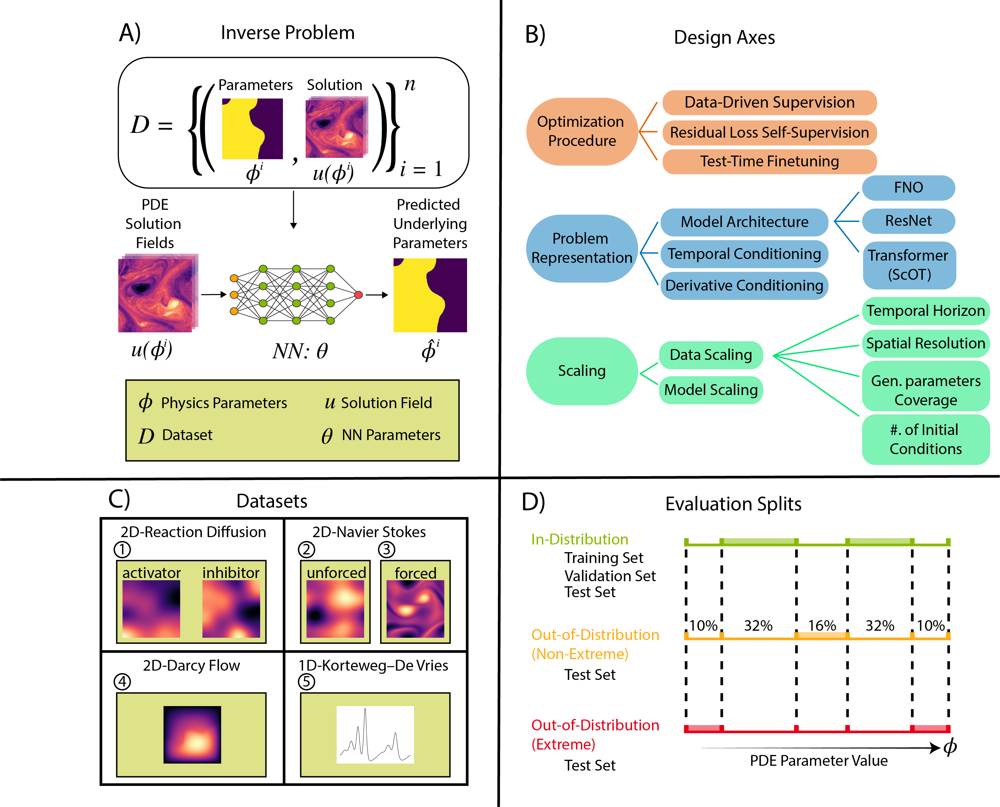

# PDEInvBench [TMLR 2026]

A one-stop shop repository for the benchmarking Neural Operators on inverse problems in partial differential equations. This is the accompanying codebase for the TMLR paper [PDEInvBench: A Comprehensive Dataset and Design Space Exploration of Neural Networks for PDE Inverse Problems](https://arxiv.org/abs/2605.25353).



## Overview

Inverse problems in partial differential equations (PDEs) involve recovering unknown physical parameters of a system—such as viscosity, diffusivity, or reaction coefficients—from observed spatiotemporal solution fields. Formally, given a PDE

$[F_{\phi}(u(x,t)) = 0]$


where $(u(x,t))$ is the solution field and $(\phi)$ represents physical parameters, the **forward problem** maps $(\phi \mapsto u)$, while the **inverse problem** seeks the reverse mapping $(u \mapsto \phi)$.

Inverse problems are inherently ill-posed and highly sensitive to noise, making them a challenging yet foundational task in scientific computing and engineering. They arise in diverse applications such as geophysical exploration, fluid mechanics, biomedical imaging, and materials design—where estimating hidden parameters from observed dynamics is essential.

**PDEInvBench** provides a comprehensive benchmark for inverse problems in partial differential equations (PDEs). The codebase supports multiple PDE systems, training strategies, neural network architectures, and configurable observation degradation operators.

## DATASET LINK:
The datasets used in this project can be found here:
https://huggingface.co/datasets/DabbyOWL/PDE_Inverse_Problem_Benchmarking/tree/main


## Table of Contents
1. [Overview](#overview)
2. [Supported Systems](#supported-systems)
3. [Supported Inverse Methods](#supported-inverse-methods)
4. [Models Implemented](#models-implemented)
5. [Directory Structure](#directory-structure)
6. [Environment Setup](#environment-setup)
7. [Downloading Data](#downloading-data)
8. [Running Experiments](#running-experiments)
   - [How Configs Work](#how-configs-work)
   - [Basic Commands](#basic-commands)
   - [Common Overrides](#common-overrides)
   - [Multi-GPU and Distributed Training](#multi-gpu-and-distributed-training)
   - [Experiment Patterns Along Core Design Axes](#-experiment-patterns-along-core-design-axes)
      - [Training/Optimization Strategies](#1️⃣-trainingoptimization-strategies)
      - [Problem Representation and Inductive Bias](#2️⃣-problem-representation-and-inductive-bias)
      - [Scaling Experiments](#3️⃣-scaling-experiments)

9. [Testing](#Testing)
10. [Shape Checking](#Shape-Checking)
11. [Adding a New Model](#adding-a-new-model)
12. [Adding a New Dataset](#adding-a-new-dataset)

## Supported Systems

- **[1D Korteweg–De Vries (KdV) Equation](DATA_GUIDE.md#4d-1d-korteweg-de-vries)**
- **[2D Reaction Diffusion](DATA_GUIDE.md#4a-2d-reaction-diffusion)**
- **[2D Unforced Navier Stokes](DATA_GUIDE.md#4b-2d-navier-stokes-unforced)**
- **[2D Forced Navier Stokes](DATA_GUIDE.md#4c-2d-turbulent-flow-forced-navier-stokes)**
- **[2D Darcy Flow](DATA_GUIDE.md#4e-2d-darcy-flow)**

For detailed technical information on each PDE system — including governing equations, parameter ranges, and dataset download instructions — refer to the [Data Guide](DATA_GUIDE.md).

## Supported Inverse Methods

- **Fully data-driven**
- **PDE Residual Loss**
- **Test-Time Tailoring (TTT)**

## Models Implemented

- **[FNO (Fourier Neural Operator)](https://arxiv.org/pdf/2010.08895)**
- **[scOT (scalable Operator Transformer)](https://proceedings.neurips.cc/paper_files/paper/2024/file/84e1b1ec17bb11c57234e96433022a9a-Paper-Conference.pdf)**
- **[ResNet](https://arxiv.org/pdf/1512.03385)**
- **[DeepONet](https://arxiv.org/pdf/1910.03193)**

For detailed technical information on the model architecture, refer to the [Model Guide](MODEL_GUIDE.md).


## Directory Structure

```
PDEInvBench
├── configs/                          # Inverse problem Hydra configuration files
│   ├── callbacks/                # Training callbacks (checkpointing, logging)
│   ├── data/                     # Dataset and data loading configurations
│   ├── lightning_module/         # PyTorch Lightning module configurations
│   ├── logging/                  # Weights & Biases logging configurations
│   ├── loss/                     # Loss function configurations
│   ├── lr_scheduler/             # Learning rate scheduler configurations
│   ├── model/                    # Neural network model configurations
│   ├── optimizer/                # Optimizer configurations
|   ├── system_params             # PDE-specific model and experiment parameters
│   ├── degradation/              # Observation degradation operator configs
│   ├── grid_transform/           # Applying transformations to solution field grid
│   ├── tailoring_optimizer/      # Test-time tailoring optimizer configs
│   └── trainer/                  # PyTorch Lightning trainer configurations
├── scripts/                          # Utility and data processing scripts
│   ├── darcy-flow-scripts/           # Darcy flow specific data processing
│   ├── parameter-perturb/            # Parameter perturbation utilities
│   ├── reaction-diffusion-scripts/   # Reaction-diffusion data processing
│   ├── data_splitter.py             # Splits datasets into train/validation sets
│   └── process_navier_stokes.py     # Processes raw Navier-Stokes data
├── pdeinvbench/                        # Main package source code
│   ├── data/                         # Data loading and preprocessing modules
│   ├── lightning_modules/            # PyTorch Lightning training modules
│   ├── losses/                       # Loss function implementations
│   ├── models/                       # Neural network model implementations
│   │   ├── __init__.py              # Package initialization
│   │   ├── conv_head.py             # Convolutional head for parameter prediction
│   │   ├── downsampler.py           # Spatial downsampling layers
│   │   ├── encoder.py               # FNO and other encoder architectures
│   │   ├── inverse_model.py         # Main inverse problem model
│   │   └── mlp.py                   # Multi-layer perceptron components
│   └── utils/                        # Utility functions and type definitions
│       ├── __init__.py              # Package initialization
│       ├── config_utils.py          # Hydra configuration utilities
│       ├── types.py                 # Type definitions and PDE system constants
│       └── ...                      # Additional utility modules
└── train_inverse.py                 # Main training script for inverse problems
```

## Environment Setup

This project requires **Python 3.11** with PyTorch 2.7, PyTorch Lightning, and several scientific computing libraries.

### Quick Setup (Recommended)

Using the provided `environment.yml`:

```bash
# Create environment (use micromamba or conda)
conda env create -f environment.yml
conda activate inv-env-tmp

# Install the package in editable mode
pip install -e .
```

### Manual Setup

Alternatively, use the `build_env.sh` script:

```bash
chmod +x build_env.sh
./build_env.sh
```

### Key Dependencies

- **Deep Learning**: PyTorch 2.7, PyTorch Lightning 2.5
- **Neural Operators**: neuraloperator 0.3.0, scOT (Poseidon fork)
- **Scientific Computing**: scipy, numpy, h5py, torch-harmonics
- **Configuration**: Hydra 1.3, OmegaConf 2.3
- **Logging**: Weights & Biases (wandb)
- **Type Checking**: jaxtyping 0.3.2, typeguard 2.13.3

**Note**: The scOT architecture requires a custom fork installed from GitHub (automatically handled in setup scripts).

### Verify Installation

```bash
python -c "import torch; import lightning; import pdeinvbench; print('Setup successful!')"
```

## Downloading Data

We provide datasets on [HuggingFace](https://huggingface.co/datasets/DabbyOWL/PDE_Inverse_Problem_Benchmarking/tree/main) with a convenient download script. Use `huggingface_pdeinv_download.py` to batch download specific datasets and splits:

```bash
pip install huggingface_hub
python3 huggingface_pdeinv_download.py --dataset darcy-flow-241 --split train --local-dir ./data
```

Available datasets include `darcy-flow-241`, `korteweg-de-vries-1d`, `navier-stokes-forced-2d`, `reaction-diffusion-2d-du`, and more. For complete dataset documentation, parameter ranges, and detailed download instructions, see the [Data Guide](DATA_GUIDE.md#2-downloading-data).

## Running Experiments

We use `hydra` to manage experiment configurations. The repository supports all combinations of:
- **PDE Systems**: `1dkdv`, `2drd`, `2dns`, `2dtf`, `2ddf`
- **Problem Representation**:
  - **Derivative conditioning**
  - **Temporal conditioning**: conditioning on 2, 5,10,15,20,25
  - **Model architectures**: FNO, ResNet, scOT (scalable Operator Transformer), DeepONet
- **Training / Optimization strategies**: 
  - **Fully data-driven supervision** — standard supervised training using paired parameter–solution data  
  - **Physics-informed (residual) training** — includes a PDE residual loss term for self-supervised regularization  
  - **Test-Time Tailoring (TTT)** — post-training fine-tuning using the PDE residual at inference time to adapt to new parameter regimes
- **Scaling**:
  - **Model Scaling**: 500k parameters, 5 million parameters, 50 million parameters 
  - **Data scaling**: parameter, initial condition, temporal horizon
  - **Resolution scaling**: 64×64, 128×128, 256×256, 512×512

### How Configs Work

#### Base Configs

Base configs are located in `configs` and provide starting points for experiments:

- Top-level configs (e.g., `1dkdv.yaml`, `2drd.yaml`) combine specific options for datasets, models, and training settings
- Individual component configs are in subdirectories (e.g., `configs/data/`, `configs/model/`)

#### Hydra Override Mechanism

Hydra allows you to override any configuration parameter via command line:

1. **Simple parameter override**: `parameter=value`
2. **Nested parameter override**: `group.parameter=value`
3. **Adding new parameters**: `+new_parameter=value`

All overrides are automatically appended to the W&B experiment name for easy tracking.

### Basic Commands

```bash
# Run with a predefined config
python3 train_inverse.py --config-name={pde_system}

# Run in test mode (evaluation only)
python3 train_inverse.py --config-name={pde_system} +test_run=true

# Load a model from W&B
python3 train_inverse.py --config-name={pde_system} +inverse_model_wandb_run={project_id}/{project_name}/model-{model_id}:{version}

# Load a model from a local checkpoint instead of W&B
python3 train_inverse.py --config-name={pde_system} \
    +inverse_model_checkpoint_path=/absolute/path/to/checkpoint.ckpt

# If both inverse_model_checkpoint_path and inverse_model_wandb_run are set,
# the W&B-based inverse_model_wandb_run takes precedence.
```
pde_system: `1dkdv`, `2dtf`, `2dns`, `2drdk`, `2drddu`, `2ddf`
### Common Overrides

#### Data-related Overrides
```bash
# Specify data root directory
data.data_root=/path/to/data

# Control time window sampling
data.every_nth_window=10

# Control fraction of data used
data.frac_ics_per_param=0.5
data.frac_param_combinations=0.5

# Control train/test temporal split
data.train_window_end_percent=0.5
data.test_window_start_percent=0.76

# High-resolution data processing
high_resolution=True
data.downsample_factor=4  # Downsample from 512x512 to 128x128
data.downsample_factor=2  # Downsample from 256x256 to 128x128
data.batch_size=2  # Reduce batch size for higher resolution data
```

#### Model-related Overrides
```bash
# Choose a model
model=fno
model=scot
model=resnet
model=deeponet
model=fno_50mil  # Higher capacity model
model=fno_500k   # Lower capacity model

# Configure model parameters
model.model_config.paramnet.encoder.use_partials=False

# Specify which parameters to predict (e.g., for ablation studies)
model.paramnet.params_to_predict=['Du']
model.paramnet.params_to_predict=['Dv']
```

#### Training Overrides
```bash
# Control distributed training
+trainer.num_nodes=2

# Set random seed
seed=0

# Load a pre-trained model
+inverse_model_wandb_run={project_id}/{project_name}/model-{model_id}:{version}

# Enable test-only mode (no training)
+test_run=true
```

#### Loss-related Overrides
```bash
# Adjust loss weights
loss.inverse_param_loss_weight=0
loss.inverse_residual_loss_weight=1
```

#### Degradation Overrides
```bash
# Apply Butterworth low-pass filter to train and test
python3 train_inverse.py --config-name={pde_system} \
    train_degradation=butterworth \
    test_degradation=butterworth

# Apply salt-and-pepper noise to test only (train on clean data)
python3 train_inverse.py --config-name={pde_system} \
    test_degradation=salt_and_pepper

# Override degradation parameters
python3 train_inverse.py --config-name={pde_system} \
    test_degradation=butterworth \
    test_degradation.drop_ratio=0.5 \
    test_degradation.order=4

# Different degradation per split
python3 train_inverse.py --config-name={pde_system} \
    train_degradation=salt_and_pepper \
    test_degradation=butterworth
```

Available degradation configs: `butterworth` (Fourier low-pass filter), `salt_and_pepper` (impulsive noise). Default is `null` (no degradation / identity).


#### Grid Transform Overrides
```bash
# Enable non-uniform mesh transform (default axis = x, drop_ratio = 0.05)
python3 train_inverse.py --config-name={pde_system} \
    grid_transform=non_uniform_mesh

# Apply non-uniform subsampling along y-axis
python3 train_inverse.py --config-name={pde_system} \
    grid_transform=non_uniform_mesh \
    grid_transform.axis=y

# Increase sparsity of the sampled grid
python3 train_inverse.py --config-name={pde_system} \
    grid_transform=non_uniform_mesh \
    grid_transform.drop_ratio=0.2
```

Available grid transform configs: `non_uniform_mesh`. Default is `null` (no grid transform).

This transform is applied in the dataloader to the conditioning field `x` and returns an updated `spatial_grid`. It can be used to evaluate inverse-model robustness under non-uniformly sampled coordinates.

#### Logging Overrides
```bash
# Set W&B project and directory
logging.project=my_project
logging.save_dir=/path/to/wandb/cache
```

### Multi-GPU and Distributed Training

```bash
# Single GPU
CUDA_VISIBLE_DEVICES=0 python3 train_inverse.py --config-name={pde_system}

# Multi-node with SLURM
srun python3 train_inverse.py --config-name={pde_system} +trainer.num_nodes={num_nodes}
# num_nodes = 1, 2, 4, etc.
```

### 🧪 Experiment Patterns Along Core Design Axes

This section provides ready-to-run experiment templates organized by the core research dimensions of the benchmark. Each pattern includes concrete commands and parameter sweep recommendations.

---

#### 1️⃣ Training/Optimization Strategies

Experiments exploring different supervision and optimization approaches for inverse problems.

##### 1.1 Fully Data-Driven vs Physics-Informed Training

```bash
# Fully data-driven (no residual loss)
python3 train_inverse.py --config-name={pde_system} \
    loss.inverse_residual_loss_weight=0

# Physics-informed with varying residual weights
python3 train_inverse.py --config-name={pde_system} \
    loss.inverse_residual_loss_weight={weight}
# Recommended sweep: weight = 1.0, 0.1, 0.01, 0.001, 0.0001
```

This allows you to control the balance between data-driven supervision and physics-based regularization for parameter identification.

##### 1.2 Test-Time Tailoring (TTT)

At test time, given an observed PDE trajectory `u_{t-k}, ..., u_t`, the inverse model `f_θ` predicts parameters `φ̂ = f_θ(u_{t-k}, ..., u_t)`.  
Test-Time Tailoring (TTT) adapts `f_θ` by minimizing a physics-based self-supervised loss derived from the PDE residual:

`L_Tailor = ||F_{φ̂}(u_{t-k}, ..., u_t)||² + α * ( ||f_θ(u_{t-k}, ..., u_t) - f_{θ_frozen}(u_{t-k}, ..., u_t)||² / ||f_{θ_frozen}(u_{t-k}, ..., u_t)||² )`

Here `F_{φ̂}` is a discrete approximation of the PDE operator, and `α` controls the strength of the *anchor loss* that stabilizes adaptation. Optimization is performed for a small number of gradient steps on `L_Tailor`, allowing the model to specialize to new or out-of-distribution parameter regimes at inference time.

```bash
# Basic TTT with pre-trained model
python3 train_inverse.py --config-name={pde_system}_ttt \
    inverse_model_wandb_run={project_id}/{project_name}/model-{model_id}:{version} \
    tailor_anchor_loss_weight={alpha} \
    num_tailoring_steps={steps} \
    tailoring_optimizer_lr={lr}

```

---

#### 2️⃣ Problem Representation and Inductive Bias

Experiments exploring how to encode physical problems and what architectural inductive biases work best.

##### 2.1 Conditioning Strategy: Derivatives vs Raw Solutions

```bash
# Derivative conditioning (spatial/temporal derivatives as input)
python3 train_inverse.py --config-name={pde_system} \
    model.model_config.paramnet.encoder.use_partials=True

# Temporal conditioning (raw solution snapshots only)
python3 train_inverse.py --config-name={pde_system} \
    model.model_config.paramnet.encoder.use_partials=False
```

Derivative conditioning provides explicit gradient information from the frames.

##### 2.2 Model Architecture: Inductive Biases

```bash
# Fourier Neural Operator (spectral bias)
python3 train_inverse.py --config-name={pde_system} model=fno

# ResNet (convolutional locality bias)
python3 train_inverse.py --config-name={pde_system} model=resnet

# scOT - Scalable Operator Transformer (attention-based)
python3 train_inverse.py --config-name={pde_system} model=scot

# DeepONet (branch-trunk factorization)
python3 train_inverse.py --config-name={pde_system} model=deeponet
```

##### 2.3 Temporal Conditioning Frames

```bash
# Fourier Neural Operator (spectral bias)
python3 train_inverse.py --config-name={pde_system} n_past={num_frames}

# num_frames=2,5,10,15,20
```


---

#### 3️⃣ Scaling Experiments

Experiments investigating how performance scales with model capacity, data quantity, and spatial resolution.

##### 3.1 Model Capacity Scaling

```bash
# Small model: ~500k parameters
python3 train_inverse.py --config-name={pde_system} model=fno_500k

# Base model: ~5M parameters
python3 train_inverse.py --config-name={pde_system} model=fno

# Large model: ~50M parameters
python3 train_inverse.py --config-name={pde_system} model=fno_50mil
```


##### 3.2 Data Quantity Scaling

###### 3.2.1 Initial Condition Diversity Scaling
```bash
python3 train_inverse.py --config-name={pde_system} \
    data.frac_ics_per_param={frac}
# Recommended sweep: frac = 0.2, 0.35, 0.5, 0.75
```

Only `frac_ics_per_param` percent of initial trajectories per parameter will be sampled during training, allowing you to control the amount of initial condition diversity and study data efficiency across different initial states.

###### 3.2.2 Parameter Space Coverage Scaling
```bash
python3 train_inverse.py --config-name={pde_system} \
    data.frac_param_combinations={frac}
# Recommended sweep: frac = 0.2, 0.35, 0.5, 0.75
```

Only `frac_param_combinations` percent of parameters from the train set will be sampled, allowing you to control parameter space coverage and understand how model performance scales with the diversity of parameter combinations in the training data.

###### 3.2.3 Temporal Horizon Scaling
```bash
python3 train_inverse.py --config-name={pde_system} \
    data.train_window_end_percent={train_end} \
    data.test_window_start_percent={test_start}
# Recommended sweeps:
# train_end = 0.25, 0.5, 0.76, 1.0
# test_start =  0.76
```

Only the first `train_window_end_percent` of trajectories are used for training, while the last `test_window_start_percent` are used for evaluation. This enables studies on temporal extrapolation and how much temporal dynamics are needed for accurate parameter identification.

##### 3.3 Spatial Resolution Scaling

```bash
# High-resolution experiments with online downsampling
python3 train_inverse.py --config-name={pde_system} \
    high_resolution=True \
    data.downsample_factor={factor} \
    data.batch_size={batch_size}

# Example configurations:
# factor=1,   512×512 (full resolution)
# factor=2,   256×256
# factor=4,   128×128
# factor=8,   64×64
```

The `HIGH_RESOLUTION_PDE_SPATIAL_SIZE` in `pdeinvbench/utils/types.py` defines the maximum resolution (typically 512×512), and the downsampling factor reduces from this maximum. These experiments help determine how resolution affects identifiability of parameters and whether models trained on low-resolution data can generalize to high-resolution inputs.

## Testing

The `tests/` directory contains validation scripts to verify the correctness of PDE residual computations and numerical implementations.

### Test Structure

- **`test_fluids.py`**: Validates turbulent flow and Navier-Stokes residual computations by comparing PyTorch implementations against NumPy reference implementations
- **`fluids_numpy_reference.py`**: NumPy reference implementations for fluid dynamics operators (stream function, advection, Laplacian)
- **`reaction-diffusion-residuals.py`**: Validates reaction-diffusion residual computations and generates visualization GIFs

### Running Tests

**Standard pytest (skips tests requiring external data):**
```bash
pytest tests/ -v
```

### Test Validation

The validation tests verify:
1. **Numerical accuracy**: Finite difference operators match reference implementations (error < 1e-3)
2. **PDE residuals**: Ground-truth solutions produce near-zero residuals (typically < 1e-4)
3. **Operator correctness**: Stream function, advection, Laplacian, and gradient computations
4. **Batch independence**: No cross-contamination between batch elements

### Data Requirements

Some tests require external HDF5 datasets:
- Tests automatically **skip** (not fail) when data is unavailable
- Suitable for CI/CD environments without large datasets
- For full validation, download datasets following the [Data Guide](DATA_GUIDE.md)

### Visualization

Residual validation scripts generate animated GIFs in `test-images/` showing:
- Temporal evolution of PDE residuals
- Spatial distribution of numerical errors
- Threshold-based error highlighting


## Shape-Checking

This codebase uses [jaxtyping](https://github.com/google/jaxtyping) for runtime tensor shape validation, which helps catch dimension mismatches.

**To disable shape checking for faster execution:**
```bash
# Disable for production runs
export JAXTYPING_DISABLE=1
python train_inverse.py --config-name=2dtf model=fno

# Or inline
JAXTYPING_DISABLE=1 python train_inverse.py --config-name=2dtf model=fno
```

## Adding a New Dataset

To add a new PDE system to the benchmark, follow the guide in [Data Guide - Section 5: Adding a New Dataset](DATA_GUIDE.md#5-adding-a-new-dataset).

## Adding a New Model

To add a new encoder architecture (e.g., Transformer, U-Net), follow the guide in [Model Guide - Adding a New Model](MODEL_GUIDE.md#adding-a-new-model).
